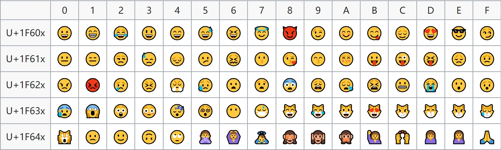
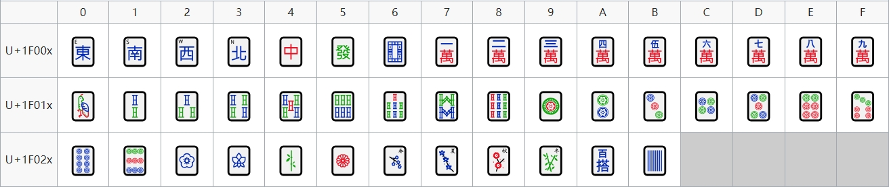

# Learn Unicode the easy way

-   [Learn Unicode the easy way](#learn-unicode-the-easy-way)
    -   [Unicode 简介](#unicode-简介)
    -   [Unicode 字符存储](#unicode-字符存储)
        -   [UTF-8 编码](#utf-8-编码)
            -   [示例](#示例)
            -   [编码实现](#编码实现)
            -   [解码实现](#解码实现)
        -   [UTF-16 编码](#utf-16-编码)
        -   [UTF-32 编码](#utf-32-编码)
    -   [处理工具](#处理工具)
    -   [Unicode 字符平面映射](#unicode-字符平面映射)
        -   [基本多文种平面](#基本多文种平面)
        -   [常用的 Unicode 字符范围](#常用的-unicode-字符范围)
    -   [Unicode 字符类别](#unicode-字符类别)

## Unicode 简介

Unicode，全称为 Unicode 标准 (The Unicode Standard)，是为了解决传统[字符编码](https://en.wikipedia.org/wiki/Character_encoding)方案的局限而产生的，它为每种语言中的每个字符分配唯一的字符编号即代码点 (Code Point)，以满足跨语言、跨平台进行文本转换、处理的要求。

Unicode 字符集的编码范围为`0x000000~0x10FFFF`，可以容纳一百多万个字符，每个字符都有一个独一无二的二进制数值与之相对应，比如：汉字 "中" 的码点为`0x4E2D`。

以下为一些有意思的 Unicode 字符：





## Unicode 字符存储

Unicode 字符集只规定了每个字符的二进制值，但字符具体如何存储并没有规定。UTF-8, UTF-16, UTF-32 分别代表了三种不同形式的存储和编码的映射规则。其中 "UTF" 是 "Unicode Transformation Format" 的缩写，意思是 "Unicode 转换格式"，后面的数字表明至少使用多少个比特位来存储字符。比如：UTF-8 编码至少需要 8 个比特位也就是一个字节来存储字符，UTF-16 和 UTF-32 分别需要最少 2 个字节和 4 个字节来存储字符。

### UTF-8 编码

UTF-8 编码是 Unicode 字符集的一种编码方式，其特点是使用**变长字节数**来编码，每个代码点被编码为 1 至 4 个字节。

| 字节数 | Unicode 编码范围        | 十进制范围           | 二进制编码格式                             |
| --- | ------------------- | --------------- | ----------------------------------- |
| 单字节 | 0x0000 - 0x007F     | 0 - 127         | 0XXXXXXX（兼容 ASCII 编码）               |
| 双字节 | 0x0080 - 0x07FF     | 128 - 2047      | 110XXXXX 10XXXXXX                   |
| 三字节 | 0x0800 - 0xFFFF     | 2048 - 65535    | 1110XXXX 10XXXXXX 10XXXXXX          |
| 四字节 | 0x010000 - 0x10FFFF | 65536 - 1114111 | 11110XXX 10XXXXXX 10XXXXXX 10XXXXXX |

二进制编码格式中的 0、110、1110、11110 和 10 相当于 UTF-8 编码中各个字节的前缀，因此称之为前缀码。**UTF-8 编码中的前缀码起到了很好的区分和标识的作用**：

- 若当前字节的首位为 0，表示这是一个单字节编码的 ASCII 字符；

- 若当前字节的前两位为 10，表示该字节为多字节编码字符的后续字节（非首字节）；

- 若当前字节的前两位为 11，表示该字节为多字节编码字符的首字节。前缀码有多少个 1，表示该字符为几个字节的编码。

```cpp
#include <stdio.h>
#include <string.h>

int main() {
  const char* s = "test字符串";
  int len = strlen(s);
  for (int i = 0; i < len; ++i) {
    if ((s[i] & 0x80) == 0)
      printf("这是一个单字节编码的 ASCII 字符\n");
    else {
      if ((s[i] & 0xC0) == 0x80)
        printf("该字节为多字节编码字符的后续字节（非首字节）\n");
      else
        printf("该字节为多字节编码字符的首字节\n");
    }
  }
}
```

#### 示例

以汉字 "国" 为例：

- 编码时："国" 的 Unicode 为 0x56FD (101011011111101)，对照可知其 UTF-8 编码为 3 个字节，编码形式为 1110XXXX 10XXXXXX 10XXXXXX，填充方式是将 "国" 的 Unicode 二进制从后向前填充，多余的 X 使用 0 替换，因此 "国" 的 UTF-8 编码为 11100101 10011011 10111101，转换为十六进制为 0xE59BBD；

- 解码时：如果首字节首位为 0，则该字节对应一个 ASCII 字符。如果首字节前三位为 110，那么表示 2 个字节表示一个字符（首字节前 n 位为 1 的个数代表字符占用字节数）。"国" 的 UTF-8 编码为 11100101 10011011 10111101，首字节的前三位为 1，说明是 3 个字节表示一个字符，根据规则 1110XXXX 10XXXXXX 10XXXXXX 获取到 X 的部分，即 101011011111101，转换为十六进制为 0x56FD，对应 Unicode 字符集的汉字 "国"。

#### 编码实现

使用`get_codepoint_bytes`函数获得码点需要占用的字节数

```cpp
int get_codepoint_bytes(int cp) {
  if (cp <= 0x7F)
    return 1;
  if (cp <= 0x7FF)
    return 2;
  if (cp <= 0xFFFF)
    return 3;
  return 4;
}
```

使用函数`utf8_encode`获得码点的 UTF-8 编码

```cpp
void utf8_encode(int cp, char* dst, int cp_bytes) {
    switch (cp_bytes) {
      case 4: dst[cp_bytes - 3] = 0x80 | ((cp >> 12) & 0x3F);
      case 3: dst[cp_bytes - 2] = 0x80 | ((cp >>  6) & 0x3F);
      case 2: dst[cp_bytes - 1] = 0x80 | ((cp >>  0) & 0x3F);
              dst[0] = (unsigned char)((0xFF00uL >> cp_bytes) | (cp >> (6 * cp_bytes - 6)));
              break;
      case 1:
              dst[0] = (unsigned char)cp;
              break;
    }
}
```

#### 解码实现

使用`get_num_bytes_of_utf8_char`函数根据 UTF-8 编码的首字节获得编码占用的字节数

```cpp
int get_num_bytes_of_utf8_char(char first_byte, int len = 0) {
  assert(((unsigned char)first_byte & 0xC0) != 0x80);
  if (((unsigned char)first_byte & 0x80) == 0)
    return 1;
  if (((unsigned char)first_byte & 0xE0) == 0xC0)
    return 2;
  if (((unsigned char)first_byte & 0xF0) == 0xE0)
    return 3;
  return 4;
}
```

使用`utf8_decode`函数获得字符的 Unicode 值

```cpp
int utf8_decode(const char* s, int cp_bytes) {
  int cp = (unsigned char)*s;
  if (cp_bytes > 1) {
    cp &= 0x7F >> cp_bytes;
    for (int i = 1; i < cp_bytes; ++i)
      cp = (cp << 6) | ((unsigned char)s[i] & 0x3F);
  }
  return cp;
}
```

UTF-8 编码的优势是节省空间、自动纠错性能好、利于传输、扩展性强，劣势是不利于程序内部处理，比如正则表达式检索。

### UTF-16 编码

UTF-16 编码将 Unicode 分成了两个范围，分别通过不同的方式进行存储。

| 字节数 | Unicode 编码范围       | 十进制范围           | 二进制编码格式                           |
| --- | ------------------ | --------------- | --------------------------------- |
| 双字节 | 0x0000 - 0xFFFF    | 0 - 65535       | XXXXXXXX XXXXXXXX                 |
| 四字节 | 0x10000 - 0x10FFFF | 65536 - 1114111 | 110110YYYYYYYYYY 110111XXXXXXXXXX |

在 Unicode 基本多文种平面内有个代理区，编码范围是`0xD800~0xDFFF`，共有 2048 个码位，此区间不对应任何字符，主要用于映射其他辅助平面的字符。代理区分为两部分：`0xD800~0xDBFF`为高位代理，`0xDC00~0xDFFF`为低位代理。

UTF-16 编码的规则是：

- 基本平面`(0x0000~0xFFFF)`内的字符使用两个字节来表示，直接进行二进制编码。

- 其他辅助平面`(0x010000~0x10FFFF)`内的字符使用四个字节来表示：
  
  - 首先将代码点减去`0x010000`，得到一个位于`0x00`和`0x0FFFFF`之间的数字
  
  - 将该数字转换为 20 位二进制数，位数不够的左边补 0，记作`YYYYYYYYYY XXXXXXXXXX`
  
  - 取出`YYYYYYYYYY`，并加上`11011000 00000000 (0xD800)`得到高位代理
  
  - 取出`XXXXXXXXXX`，并加上`11011100 00000000 (0xDC00)`得到低位代理
  
  - 高位代理和低位代理相连，得到`110110YY YYYYYYYY 110111XX XXXXXXXX`

以汉字 "国" 为例，编码时："国" 的 Unicode 为 0x56FD (101011011111101)，直接进行二进制编码，位数不够的左边补 0，因此 "国" 的 UTF-16 编码为 0101011011111101，即 0x56FD。

以汉字 "𠈠" 为例，编码时："𠈠" 的 Unicode 为 0x20220 (100000001000100000)，对照可知其 UTF-16 编码为 4 个字节，首先将 0x20220 减去 0x10000 得到 0x10220，将这个数字转化为 20 位二进制数，即为 00010000001000100000，取出前 10 位 (0001000000) 并加上 0xD800 得到高位代理 1101100001000000 (0xD840)，取出后 10 位 (1000100000) 并加上 0xDC00 得到低位代理 1101111000100000 (0xDE20)，将高位代理与低位代理相连，得到 "𠈠" 的 UTF-16 编码为 0xD840DE20。

对于含有大量中文或其他二字节长的字符流来说，UTF-16 编码可以节省大量的存储空间。但由于 UTF-8 的兼容性和对英文的支持，西方都提倡统一使用 UTF-8 作为字符编码，这样可以彻底解决乱码问题，目前基本上所有的开发环境和源代码文件都是统一的 UTF-8 编码。

### UTF-32 编码

| 字节数 | Unicode 编码范围      | 十进制范围       | 二进制编码格式                             |
| --- | ----------------- | ----------- | ----------------------------------- |
| 四字节 | 0x0000 - 0x10FFFF | 0 - 1114111 | XXXXXXXX XXXXXXXX XXXXXXXX XXXXXXXX |

UTF-32 编码的规则是使用 4 个字节存储字符，直接进行代码点的二进制编码，向左补 0。

以汉字 "国" 为例，其 Unicode 为 0x56FD (101011011111101)，直接进行二进制编码并补 0，得到 000000000101011011111101。

## 处理工具

- The home of the ICU project source code: https://github.com/unicode-org/icu

- a clean C library for processing UTF-8 Unicode data: https://github.com/JuliaStrings/utf8proc

- A bridge between Unicode encoded strings and std::string: https://github.com/zejunwang1/stringutils

- Unicode (UTF-8) capable std::string: https://github.com/DuffsDevice/tiny-utf8

- UTF-8 with C++ in a Portable Way: https://github.com/nemtrif/utfcpp

- single header utf8 string functions for C and C++: https://github.com/sheredom/utf8.h

## Unicode 字符平面映射

Unicode 将编码空间分成 17 个平面，以 0 到 16 编号，每个平面包含 65536 个代码点，目前仅使用了少数平面。

| 平面         | 编码范围                | 中文名称          | 英文名称                                       |
| ---------- | ------------------- | ------------- | ------------------------------------------ |
| 0号平面       | U+0000 - U+FFFF     | 基本多文种平面       | Basic Multilingual Plane，简称 BMP            |
| 1号平面       | U+10000 - U+1FFFF   | 多文种补充平面       | Supplementary Multilingual Plane，简称 SMP    |
| 2号平面       | U+20000 - U+2FFFF   | 表意文字补充平面      | Supplementary Ideographic Plane，简称 SIP     |
| 3号平面       | U+30000 - U+3FFFF   | 表意文字第三平面      | Tertiary Ideographic Plane，简称 TIP          |
| 4号平面~13号平面 | U+40000 - U+DFFFF   | （尚未使用）        |                                            |
| 14号平面      | U+E0000 - U+EFFFF   | 特别用途补充平面      | Supplementary Special-purpose Plane，简称 SSP |
| 15号平面      | U+F0000 - U+FFFFF   | 保留作为私人使用区（A区） | Private Use Area-A，简称 PUA-A                |
| 16号平面      | U+100000 - U+10FFFF | 保留作为私人使用区（B区） | Private Use Area-B，简称 PUA-B                |

### 基本多文种平面

基本多文种平面 (Basic Multilingual Plane, BMP) 又称基本平面或 0 号平面，收集了使用最广泛的字符，代码点从`U+0000`到`U+FFFF`。

| 编码范围                                                                                                                    | 中文名称                                                                                                                                                                                                                                                                                                                                                 | 英语名称                                           |
| ----------------------------------------------------------------------------------------------------------------------- | ---------------------------------------------------------------------------------------------------------------------------------------------------------------------------------------------------------------------------------------------------------------------------------------------------------------------------------------------------- | ---------------------------------------------- |
| 0000-007F                                                                                                               | 基本[拉丁文](https://zh.wikipedia.org/wiki/%E6%8B%89%E4%B8%81%E5%AD%97%E6%AF%8D "拉丁字母")                                                                                                                                                                                                                                                                   | Basic Latin                                    |
| 0080-00FF                                                                                                               | [拉丁字母补充-1](https://zh.wikipedia.org/wiki/%E6%8B%89%E4%B8%81%E5%AD%97%E6%AF%8D%E8%A3%9C%E5%85%85-1 "拉丁字母补充-1")                                                                                                                                                                                                                                        | Latin-1 Supplement                             |
| 0100-017F                                                                                                               | [拉丁字母扩展-A](https://zh.wikipedia.org/wiki/%E6%8B%89%E4%B8%81%E5%AD%97%E6%AF%8D%E6%93%B4%E5%B1%95-A "拉丁字母扩展-A")                                                                                                                                                                                                                                        | Latin Extended-A                               |
| 0180-024F                                                                                                               | [拉丁字母扩展-B](https://zh.wikipedia.org/wiki/%E6%8B%89%E4%B8%81%E5%AD%97%E6%AF%8D%E6%93%B4%E5%B1%95-B "拉丁字母扩展-B")                                                                                                                                                                                                                                        | Latin Extended-B                               |
| 0250-02AF                                                                                                               | [国际音标](https://zh.wikipedia.org/wiki/%E5%9B%BD%E9%99%85%E9%9F%B3%E6%A0%87 "国际音标")扩展                                                                                                                                                                                                                                                                  | IPA Extensions                                 |
| 02B0-02FF                                                                                                               | [占位修饰符号](https://zh.wikipedia.org/wiki/%E4%BD%94%E4%BD%8D%E4%BF%AE%E9%A3%BE%E7%AC%A6%E8%99%9F_(Unicode%E5%8D%80%E6%AE%B5) "占位修饰符号 (Unicode区段)")                                                                                                                                                                                                      | Spacing Modifier Letters                       |
| 0300-036F                                                                                                               | [结合附加符号](https://zh.wikipedia.org/wiki/%E7%B5%90%E5%90%88%E9%99%84%E5%8A%A0%E7%AC%A6%E8%99%9F "结合附加符号")                                                                                                                                                                                                                                              | Combining Diacritics Marks                     |
| 0370-03FF                                                                                                               | [希腊字母](https://zh.wikipedia.org/wiki/%E5%B8%8C%E8%85%8A%E5%AD%97%E6%AF%8D "希腊字母")及[科普特字母](https://zh.wikipedia.org/wiki/%E7%A7%91%E6%99%AE%E7%89%B9%E5%AD%97%E6%AF%8D "科普特字母")                                                                                                                                                                       | Greek and Coptic                               |
| 0400-04FF                                                                                                               | [西里尔字母](https://zh.wikipedia.org/wiki/%E8%A5%BF%E9%87%8C%E5%B0%94%E5%AD%97%E6%AF%8D "西里尔字母")                                                                                                                                                                                                                                                         | Cyrillic                                       |
| 0500-052F                                                                                                               | [西里尔字母补充](https://zh.wikipedia.org/wiki/%E8%A5%BF%E9%87%8C%E7%88%BE%E5%AD%97%E6%AF%8D%E8%A3%9C%E5%85%85 "西里尔字母补充")                                                                                                                                                                                                                                   | Cyrillic Supplement                            |
| 0530-058F                                                                                                               | [亚美尼亚字母](https://zh.wikipedia.org/wiki/%E4%BA%9A%E7%BE%8E%E5%B0%BC%E4%BA%9A%E5%AD%97%E6%AF%8D "亚美尼亚字母")                                                                                                                                                                                                                                              | Armenian                                       |
| 0590-05FF                                                                                                               | [希伯来文](https://zh.wikipedia.org/wiki/%E5%B8%8C%E4%BC%AF%E6%9D%A5%E6%96%87 "希伯来文")                                                                                                                                                                                                                                                                    | Hebrew                                         |
| 0600-06FF                                                                                                               | [阿拉伯文](https://zh.wikipedia.org/wiki/%E9%98%BF%E6%8B%89%E4%BC%AF%E6%96%87 "阿拉伯文")                                                                                                                                                                                                                                                                    | Arabic                                         |
| 0700-074F                                                                                                               | [叙利亚文](https://zh.wikipedia.org/wiki/%E5%8F%99%E5%88%A9%E4%BA%9A%E6%96%87 "叙利亚文")                                                                                                                                                                                                                                                                    | Syriac                                         |
| 0750-077F                                                                                                               | [阿拉伯字母补充](https://zh.wikipedia.org/wiki/%E9%98%BF%E6%8B%89%E4%BC%AF%E5%AD%97%E6%AF%8D%E8%A3%9C%E5%85%85 "阿拉伯字母补充")                                                                                                                                                                                                                                   | Arabic Supplement                              |
| 0780-07BF                                                                                                               | [它拿字母](https://zh.wikipedia.org/wiki/%E5%AE%83%E6%8B%BF%E5%AD%97%E6%AF%8D "它拿字母")                                                                                                                                                                                                                                                                    | Thaana                                         |
| 07C0-07FF                                                                                                               | [西非书面文字](https://zh.wikipedia.org/wiki/%E8%A5%BF%E9%9D%9E%E6%9B%B8%E9%9D%A2%E6%96%87%E5%AD%97 "西非书面文字")                                                                                                                                                                                                                                              | N'Ko                                           |
| 0800-083F                                                                                                               | [撒玛利亚字母](https://zh.wikipedia.org/w/index.php?title=%E6%92%92%E7%8E%9B%E5%88%A9%E4%BA%9A%E5%AD%97%E6%AF%8D&action=edit&redlink=1)                                                                                                                                                                                                                    | Samaritan                                      |
| 0840-085F                                                                                                               | [曼达文字](https://zh.wikipedia.org/w/index.php?title=%E6%9B%BC%E8%BE%BE%E6%96%87%E5%AD%97&action=edit&redlink=1)                                                                                                                                                                                                                                        | Mandaic                                        |
| 0860-086F                                                                                                               | 叙利亚文补充                                                                                                                                                                                                                                                                                                                                               | Syriac Supplement                              |
| 0870-089F                                                                                                               | 阿拉伯文扩展-B                                                                                                                                                                                                                                                                                                                                             | Arabic Extended-B                              |
| 08A0-08FF                                                                                                               | 阿拉伯文扩展-A                                                                                                                                                                                                                                                                                                                                             | Arabic Extended-A                              |
| 0900-097F                                                                                                               | [天城文](https://zh.wikipedia.org/wiki/%E5%A4%A9%E5%9F%8E%E6%96%87 "天城文")                                                                                                                                                                                                                                                                               | Devanagari                                     |
| 0980-09FF                                                                                                               | [孟加拉文](https://zh.wikipedia.org/wiki/%E5%AD%9F%E5%8A%A0%E6%8B%89%E6%96%87 "孟加拉文")                                                                                                                                                                                                                                                                    | Bengali                                        |
| 0A00-0A7F                                                                                                               | [古木基文](https://zh.wikipedia.org/wiki/%E5%8F%A4%E6%9C%A8%E5%9F%BA%E6%96%87 "古木基文")                                                                                                                                                                                                                                                                    | Gurmukhi                                       |
| 0A80-0AFF                                                                                                               | [古吉拉特文](https://zh.wikipedia.org/wiki/%E5%8F%A4%E5%90%89%E6%8B%89%E7%89%B9%E6%96%87 "古吉拉特文")                                                                                                                                                                                                                                                         | Gujarati                                       |
| 0B00-0B7F                                                                                                               | [奥里亚文](https://zh.wikipedia.org/wiki/%E5%A5%A7%E9%87%8C%E4%BA%9E%E6%96%87 "奥里亚文")                                                                                                                                                                                                                                                                    | Oriya                                          |
| 0B80-0BFF                                                                                                               | [泰米尔文](https://zh.wikipedia.org/wiki/%E6%B3%B0%E7%B1%B3%E7%88%BE%E6%96%87 "泰米尔文")                                                                                                                                                                                                                                                                    | Tamil                                          |
| 0C00-0C7F                                                                                                               | [泰卢固文](https://zh.wikipedia.org/wiki/%E6%B3%B0%E5%8D%A2%E5%9B%BA%E6%96%87 "泰卢固文")                                                                                                                                                                                                                                                                    | Telugu                                         |
| 0C80-0CFF                                                                                                               | [卡纳达文](https://zh.wikipedia.org/wiki/%E5%8D%A1%E7%B4%8D%E9%81%94%E6%96%87 "卡纳达文")                                                                                                                                                                                                                                                                    | Kannada                                        |
| 0D00-0D7F                                                                                                               | [马拉雅拉姆文](https://zh.wikipedia.org/wiki/%E9%A6%AC%E6%8B%89%E9%9B%85%E6%8B%89%E5%A7%86%E6%96%87 "马拉雅拉姆文")                                                                                                                                                                                                                                              | Malayalam                                      |
| 0D80-0DFF                                                                                                               | [僧伽罗文](https://zh.wikipedia.org/wiki/%E5%83%A7%E4%BC%BD%E7%BD%97%E6%96%87 "僧伽罗文")                                                                                                                                                                                                                                                                    | Sinhala                                        |
| 0E00-0E7F                                                                                                               | [泰文](https://zh.wikipedia.org/wiki/%E6%B3%B0%E6%96%87 "泰文")                                                                                                                                                                                                                                                                                          | Thai                                           |
| 0E80-0EFF                                                                                                               | [老挝文](https://zh.wikipedia.org/wiki/%E8%80%81%E6%8C%9D%E6%96%87 "老挝文")                                                                                                                                                                                                                                                                               | Lao                                            |
| 0F00-0FFF                                                                                                               | [藏文](https://zh.wikipedia.org/wiki/%E8%97%8F%E6%96%87 "藏文")                                                                                                                                                                                                                                                                                          | Tibetan                                        |
| 1000-109F                                                                                                               | [缅甸文](https://zh.wikipedia.org/wiki/%E7%BC%85%E7%94%B8%E6%96%87 "缅甸文")                                                                                                                                                                                                                                                                               | Myanmar                                        |
| 10A0-10FF                                                                                                               | [格鲁吉亚字母](https://zh.wikipedia.org/wiki/%E6%A0%BC%E9%B2%81%E5%90%89%E4%BA%9A%E5%AD%97%E6%AF%8D "格鲁吉亚字母")                                                                                                                                                                                                                                              | Georgian                                       |
| 1100-11FF                                                                                                               | [谚文](https://zh.wikipedia.org/wiki/%E8%AB%BA%E6%96%87 "谚文")字母                                                                                                                                                                                                                                                                                        | Hangul Jamo                                    |
| 1200-137F                                                                                                               | [吉兹字母](https://zh.wikipedia.org/wiki/%E5%90%89%E8%8C%B2%E5%AD%97%E6%AF%8D "吉兹字母")                                                                                                                                                                                                                                                                    | Ethiopic                                       |
| 1380-139F                                                                                                               | 吉兹字母补充                                                                                                                                                                                                                                                                                                                                               | Ethiopic Supplement                            |
| 13A0-13FF                                                                                                               | [切罗基字母](https://zh.wikipedia.org/wiki/%E5%88%87%E7%BD%97%E5%9F%BA%E8%AF%AD "切罗基语")                                                                                                                                                                                                                                                                   | Cherokee                                       |
| 1400-167F                                                                                                               | 统一[加拿大原住民音节文字](https://zh.wikipedia.org/wiki/%E5%8A%A0%E6%8B%BF%E5%A4%A7%E5%8E%9F%E4%BD%8F%E6%B0%91%E9%9F%B3%E7%AF%80%E6%96%87%E5%AD%97 "加拿大原住民音节文字")                                                                                                                                                                                                | Unified Canadian Aboriginal Syllabics          |
| 1680-169F                                                                                                               | [欧甘字母](https://zh.wikipedia.org/wiki/%E6%AD%90%E7%94%98%E5%AD%97%E6%AF%8D "欧甘字母")                                                                                                                                                                                                                                                                    | Ogham                                          |
| 16A0-16FF                                                                                                               | [卢恩字母](https://zh.wikipedia.org/wiki/%E5%8D%A2%E6%81%A9%E5%AD%97%E6%AF%8D "卢恩字母")                                                                                                                                                                                                                                                                    | Runic                                          |
| 1700-171F                                                                                                               | [他加禄字母](https://zh.wikipedia.org/w/index.php?title=%E4%BB%96%E5%8A%A0%E7%A6%84%E5%AD%97%E6%AF%8D&action=edit&redlink=1)                                                                                                                                                                                                                              | Tagalog                                        |
| 1720-173F                                                                                                               | [哈努诺文](https://zh.wikipedia.org/w/index.php?title=%E5%93%88%E5%8A%AA%E8%AF%BA%E6%96%87&action=edit&redlink=1)                                                                                                                                                                                                                                        | Hanunóo                                        |
| 1740-175F                                                                                                               | [布希德文](https://zh.wikipedia.org/wiki/%E5%B8%83%E5%B8%8C%E5%BE%B7%E6%96%87 "布希德文")                                                                                                                                                                                                                                                                    | Buhid                                          |
| 1760-177F                                                                                                               | [塔格班瓦文](https://zh.wikipedia.org/w/index.php?title=%E5%A1%94%E6%A0%BC%E7%8F%AD%E7%93%A6%E6%96%87&action=edit&redlink=1)                                                                                                                                                                                                                              | Tagbanwa                                       |
| 1780-17FF                                                                                                               | [高棉文](https://zh.wikipedia.org/wiki/%E9%AB%98%E6%A3%89%E6%96%87 "高棉文")                                                                                                                                                                                                                                                                               | Khmer                                          |
| 1800-18AF                                                                                                               | [蒙古文](https://zh.wikipedia.org/wiki/%E8%92%99%E5%8F%A4%E5%AD%97%E6%AF%8D "蒙古字母")                                                                                                                                                                                                                                                                     | Mongolian                                      |
| 18B0-18FF                                                                                                               | [加拿大原住民音节文字](https://zh.wikipedia.org/wiki/%E5%8A%A0%E6%8B%BF%E5%A4%A7%E5%8E%9F%E4%BD%8F%E6%B0%91%E9%9F%B3%E7%AF%80%E6%96%87%E5%AD%97 "加拿大原住民音节文字")扩展                                                                                                                                                                                                | Unified Canadian Aboriginal Syllabics Extended |
| 1900-194F                                                                                                               | [林布文](https://zh.wikipedia.org/w/index.php?title=%E6%9E%97%E5%B8%83%E6%96%87&action=edit&redlink=1)                                                                                                                                                                                                                                                  | Limbu                                          |
| 1950-197F                                                                                                               | [德宏傣文](https://zh.wikipedia.org/wiki/%E5%BE%B7%E5%AE%8F%E5%82%A3%E6%96%87 "德宏傣文")                                                                                                                                                                                                                                                                    | Tai Le                                         |
| 1980-19DF                                                                                                               | [新傣仂文](https://zh.wikipedia.org/wiki/%E6%96%B0%E5%82%A3%E4%BB%82%E6%96%87 "新傣仂文")                                                                                                                                                                                                                                                                    | New Tai Lue                                    |
| 19E0-19FF                                                                                                               | 高棉文符号                                                                                                                                                                                                                                                                                                                                                | Khmer Symbols                                  |
| 1A00-1A1F                                                                                                               | [布吉文](https://zh.wikipedia.org/wiki/%E5%B8%83%E5%90%89%E6%96%87 "布吉文")                                                                                                                                                                                                                                                                               | Buginese                                       |
| 1A20-1AAF                                                                                                               | [老傣文](https://zh.wikipedia.org/wiki/%E8%80%81%E5%82%A3%E4%BB%82%E6%96%87 "老傣仂文")                                                                                                                                                                                                                                                                     | Tai Tham                                       |
| 1AB0-1AFF                                                                                                               | 组合[变音标记](https://zh.wikipedia.org/w/index.php?title=%E5%8F%98%E9%9F%B3%E6%A0%87%E8%AE%B0&action=edit&redlink=1 "变音标记（页面不存在）")扩展                                                                                                                                                                                                                      | Combining Diacritical Marks Extended           |
| 1B00-1B7F                                                                                                               | [巴厘字母](https://zh.wikipedia.org/wiki/%E5%B7%B4%E5%8E%98%E5%AD%97%E6%AF%8D "巴厘字母")                                                                                                                                                                                                                                                                    | Balinese                                       |
| 1B80-1BBF                                                                                                               | [巽他字母](https://zh.wikipedia.org/w/index.php?title=%E5%B7%BD%E4%BB%96%E5%AD%97%E6%AF%8D&action=edit&redlink=1)                                                                                                                                                                                                                                        | Sundanese                                      |
| 1BC0-1BFF                                                                                                               | [巴塔克文](https://zh.wikipedia.org/w/index.php?title=%E5%B7%B4%E5%A1%94%E5%85%8B%E6%96%87&action=edit&redlink=1)                                                                                                                                                                                                                                        | Batak                                          |
| 1C00-1C4F                                                                                                               | [雷布查字母](https://zh.wikipedia.org/w/index.php?title=%E9%9B%B7%E5%B8%83%E6%9F%A5%E5%AD%97%E6%AF%8D&action=edit&redlink=1)                                                                                                                                                                                                                              | Lepcha                                         |
| 1C50-1C7F                                                                                                               | [桑塔利文](https://zh.wikipedia.org/w/index.php?title=%E6%A1%91%E5%A1%94%E5%88%A9%E6%96%87&action=edit&redlink=1)                                                                                                                                                                                                                                        | Ol Chiki                                       |
| 1C80-1C8F                                                                                                               | 西里尔字母扩充-C                                                                                                                                                                                                                                                                                                                                            | Cyrillic Extended-C                            |
| 1C90-1CBF                                                                                                               | 格鲁吉亚字母扩展                                                                                                                                                                                                                                                                                                                                             | Georgian Extended                              |
| 1CC0-1CCF                                                                                                               | 巽他字母补充                                                                                                                                                                                                                                                                                                                                               | Sudanese Supplement                            |
| 1CD0-1CFF                                                                                                               | [梵文](https://zh.wikipedia.org/wiki/%E6%A2%B5%E6%96%87 "梵文")[吠陀](https://zh.wikipedia.org/wiki/%E5%90%A0%E9%99%80 "吠陀")扩展                                                                                                                                                                                                                             | Vedic Extensions                               |
| 1D00-1D7F                                                                                                               | [音标扩展](https://zh.wikipedia.org/wiki/%E9%9F%B3%E6%A8%99%E6%93%B4%E5%B1%95_(Unicode%E5%8D%80%E6%AE%B5) "音标扩展 (Unicode区段)")                                                                                                                                                                                                                            | Phonetic Extensions                            |
| 1D80-1DBF                                                                                                               | [音标扩展补充](https://zh.wikipedia.org/wiki/%E9%9F%B3%E6%A8%99%E6%93%B4%E5%B1%95%E8%A3%9C%E5%85%85_(Unicode%E5%8D%80%E6%AE%B5) "音标扩展补充 (Unicode区段)")                                                                                                                                                                                                      | Phonetic Extensions Supplement                 |
| 1DC0-1DFF                                                                                                               | 结合附加符号补充                                                                                                                                                                                                                                                                                                                                             | Combining Diacritics Marks Supplement          |
| 1E00-1EFF                                                                                                               | 拉丁文扩展附加                                                                                                                                                                                                                                                                                                                                              | Latin Extended Additional                      |
| 1F00-1FFF                                                                                                               | 希腊文扩展                                                                                                                                                                                                                                                                                                                                                | Greek Extended                                 |
| 2000-206F                                                                                                               | 常用标点                                                                                                                                                                                                                                                                                                                                                 | General Punctuation                            |
| 2070-209F                                                                                                               | [上标](https://zh.wikipedia.org/wiki/%E4%B8%8A%E6%A0%87 "上标")及[下标](https://zh.wikipedia.org/wiki/%E4%B8%8B%E6%A0%87 "下标")                                                                                                                                                                                                                              | Superscripts and Subscripts                    |
| 20A0-20CF                                                                                                               | [货币符号](https://zh.wikipedia.org/wiki/%E8%B4%A7%E5%B8%81%E7%AC%A6%E5%8F%B7 "货币符号")                                                                                                                                                                                                                                                                    | Currency Symbols                               |
| 20D0-20FF                                                                                                               | [符号用组合附加符号](https://zh.wikipedia.org/wiki/%E7%AC%A6%E8%99%9F%E7%94%A8%E7%B5%84%E5%90%88%E9%99%84%E5%8A%A0%E7%AC%A6%E8%99%9F "符号用组合附加符号")                                                                                                                                                                                                             | Combining Diacritical Marks for Symbols        |
| 2100-214F                                                                                                               | 字母式符号                                                                                                                                                                                                                                                                                                                                                | Letterlike Symbols                             |
| 2150-218F                                                                                                               | 数字形式                                                                                                                                                                                                                                                                                                                                                 | Number Forms                                   |
| 2190-21FF                                                                                                               | [箭头](https://zh.wikipedia.org/wiki/%E7%AE%AD%E5%A4%B4 "箭头")                                                                                                                                                                                                                                                                                          | Arrows                                         |
| 2200-22FF                                                                                                               | [数学运算符](https://zh.wikipedia.org/w/index.php?title=%E6%95%B0%E5%AD%A6%E8%BF%90%E7%AE%97%E7%AC%A6&action=edit&redlink=1 "数学运算符（页面不存在）")                                                                                                                                                                                                               | Mathematical Operators                         |
| 2300-23FF                                                                                                               | [杂项技术符号](https://zh.wikipedia.org/wiki/%E9%9B%9C%E9%A0%85%E6%8A%80%E8%A1%93%E7%AC%A6%E8%99%9F "杂项技术符号")                                                                                                                                                                                                                                              | Miscellaneous Technical                        |
| 2400-243F                                                                                                               | [控制图片](https://zh.wikipedia.org/w/index.php?title=%E6%8E%A7%E5%88%B6%E5%9B%BE%E7%89%87&action=edit&redlink=1)                                                                                                                                                                                                                                        | Control Pictures                               |
| 2440-245F                                                                                                               | [光学识别符](https://zh.wikipedia.org/w/index.php?title=%E5%85%89%E5%AD%A6%E8%AF%86%E5%88%AB%E7%AC%A6&action=edit&redlink=1 "光学识别符（页面不存在）")                                                                                                                                                                                                               | Optical Character Recognition                  |
| 2460-24FF                                                                                                               | [带圈字母和数字](https://zh.wikipedia.org/wiki/%E5%B8%B6%E5%9C%88%E5%AD%97%E6%AF%8D%E5%92%8C%E6%95%B8%E5%AD%97 "带圈字母和数字")                                                                                                                                                                                                                                   | Enclosed Alphanumerics                         |
| 2500-257F                                                                                                               | [制表符](https://zh.wikipedia.org/wiki/%E5%88%B6%E8%A1%A8%E7%AC%A6 "制表符")                                                                                                                                                                                                                                                                               | Box Drawing                                    |
| 2580-259F                                                                                                               | [方块元素](https://zh.wikipedia.org/wiki/%E6%96%B9%E5%A1%8A%E5%85%83%E7%B4%A0 "方块元素")                                                                                                                                                                                                                                                                    | Block Elements                                 |
| 25A0-25FF                                                                                                               | [几何图形](https://zh.wikipedia.org/wiki/%E5%87%A0%E4%BD%95%E5%9B%BE%E5%BD%A2 "几何图形")                                                                                                                                                                                                                                                                    | Geometric Shapes                               |
| 2600-26FF                                                                                                               | [杂项符号](https://zh.wikipedia.org/wiki/%E9%9B%9C%E9%A0%85%E7%AC%A6%E8%99%9F_(Unicode%E5%8D%80%E6%AE%B5) "杂项符号 (Unicode区段)")                                                                                                                                                                                                                            | Miscellaneous Symbols                          |
| 2700-27BF                                                                                                               | [装饰符号](https://zh.wikipedia.org/wiki/Dingbat "Dingbat")                                                                                                                                                                                                                                                                                              | Dingbats                                       |
| 27C0-27EF                                                                                                               | 杂项数学符号-A                                                                                                                                                                                                                                                                                                                                             | Miscellaneous Mathematical Symbols-A           |
| 27F0-27FF                                                                                                               | 追加箭头-A                                                                                                                                                                                                                                                                                                                                               | Supplemental Arrows-A                          |
| 2800-28FF                                                                                                               | [盲文点字模型](https://zh.wikipedia.org/wiki/%E7%9B%B2%E6%96%87 "盲文")                                                                                                                                                                                                                                                                                      | Braille Patterns                               |
| 2900-297F                                                                                                               | 追加箭头-B                                                                                                                                                                                                                                                                                                                                               | Supplemental Arrows-B                          |
| 2980-29FF                                                                                                               | 杂项[数学符号](https://zh.wikipedia.org/wiki/%E6%95%B8%E5%AD%B8%E7%AC%A6%E8%99%9F "数学符号")-B                                                                                                                                                                                                                                                                | Miscellaneous Mathematical Symbols-B           |
| 2A00-2AFF                                                                                                               | 追加数学运算符                                                                                                                                                                                                                                                                                                                                              | Supplemental Mathematical Operator             |
| 2B00-2BFF                                                                                                               | [杂项符号和箭头](https://zh.wikipedia.org/wiki/%E9%9B%9C%E9%A0%85%E7%AC%A6%E8%99%9F%E5%92%8C%E7%AE%AD%E9%A0%AD_(Unicode%E5%8D%80%E6%AE%B5) "杂项符号和箭头 (Unicode区段)")                                                                                                                                                                                           | Miscellaneous Symbols and Arrows               |
| 2C00-2C5F                                                                                                               | [格拉哥里字母](https://zh.wikipedia.org/wiki/%E6%A0%BC%E6%8B%89%E5%93%A5%E9%87%8C%E5%AD%97%E6%AF%8D "格拉哥里字母")                                                                                                                                                                                                                                              | Glagolitic                                     |
| 2C60-2C7F                                                                                                               | 拉丁文扩展-C                                                                                                                                                                                                                                                                                                                                              | Latin Extended-C                               |
| 2C80-2CFF                                                                                                               | [科普特字母](https://zh.wikipedia.org/wiki/%E7%A7%91%E6%99%AE%E7%89%B9%E5%AD%97%E6%AF%8D "科普特字母")                                                                                                                                                                                                                                                         | Coptic                                         |
| 2D00-2D2F                                                                                                               | [格鲁吉亚字母](https://zh.wikipedia.org/wiki/%E6%A0%BC%E9%B2%81%E5%90%89%E4%BA%9A%E5%AD%97%E6%AF%8D "格鲁吉亚字母")补充                                                                                                                                                                                                                                            | Georgian Supplement                            |
| 2D30-2D7F                                                                                                               | [提非纳文](https://zh.wikipedia.org/wiki/%E6%8F%90%E9%9D%9E%E7%B4%8D%E6%96%87 "提非纳文")                                                                                                                                                                                                                                                                    | Tifinagh                                       |
| 2D80-2DDF                                                                                                               | [吉兹字母](https://zh.wikipedia.org/wiki/%E5%90%89%E8%8C%B2%E5%AD%97%E6%AF%8D "吉兹字母")扩展                                                                                                                                                                                                                                                                  | Ethiopic Extended                              |
| 2DE0-2DFF                                                                                                               | 西里尔字母扩展-A                                                                                                                                                                                                                                                                                                                                            | Cyrillic Extended-A                            |
| 2E00-2E7F                                                                                                               | 追加标点                                                                                                                                                                                                                                                                                                                                                 | Supplemental Punctuation                       |
| 2E80-2EFF                                                                                                               | 中日韩汉字[部首](https://zh.wikipedia.org/wiki/%E9%83%A8%E9%A6%96 "部首")补充                                                                                                                                                                                                                                                                                   | CJK Radicals Supplement                        |
| 2F00-2FDF                                                                                                               | [康熙部首](https://zh.wikipedia.org/wiki/%E5%BA%B7%E7%86%99%E9%83%A8%E9%A6%96 "康熙部首")                                                                                                                                                                                                                                                                    | Kangxi Radicals                                |
| 2FF0-2FFF                                                                                                               | [表意文字序列](https://zh.wikipedia.org/wiki/%E8%A1%A8%E6%84%8F%E6%96%87%E5%AD%97%E5%BA%8F%E5%88%97 "表意文字序列")                                                                                                                                                                                                                                              | Ideographic Description Characters             |
| 3000-303F                                                                                                               | 中日韩符号和标点                                                                                                                                                                                                                                                                                                                                             | CJK Symbols and Punctuation                    |
| 3040-309F                                                                                                               | 日文[平假名](https://zh.wikipedia.org/wiki/%E5%B9%B3%E5%81%87%E5%90%8D "平假名")                                                                                                                                                                                                                                                                             | Hiragana                                       |
| 30A0-30FF                                                                                                               | 日文[片假名](https://zh.wikipedia.org/wiki/%E7%89%87%E5%81%87%E5%90%8D "片假名")                                                                                                                                                                                                                                                                             | Katakana                                       |
| 3100-312F                                                                                                               | [注音符号](https://zh.wikipedia.org/wiki/%E6%B3%A8%E9%9F%B3%E7%AC%A6%E5%8F%B7 "注音符号")                                                                                                                                                                                                                                                                    | Bopomofo                                       |
| 3130-318F                                                                                                               | [谚文](https://zh.wikipedia.org/wiki/%E8%B0%9A%E6%96%87 "谚文")兼容字母                                                                                                                                                                                                                                                                                      | Hangul Compatibility Jamo                      |
| 3190-319F                                                                                                               | [汉文](https://zh.wikipedia.org/wiki/%E6%BC%A2%E6%96%87%E8%A8%93%E8%AE%80 "汉文训读")注释标志                                                                                                                                                                                                                                                                  | Kanbun                                         |
| 31A0-31BF                                                                                                               | 注音字母扩展                                                                                                                                                                                                                                                                                                                                               | Bopomofo Extended                              |
| 31C0-31EF                                                                                                               | 中日韩[笔画](https://zh.wikipedia.org/wiki/%E7%AC%94%E7%94%BB "笔画")                                                                                                                                                                                                                                                                                       | CJK Strokes                                    |
| 31F0-31FF                                                                                                               | 日文片假名拼音扩展                                                                                                                                                                                                                                                                                                                                            | Katakana Phonetic Extensions                   |
| 3200-32FF                                                                                                               | [带圈的CJK字符及月份](https://zh.wikipedia.org/wiki/%E5%B8%A6%E5%9C%88%E7%9A%84CJK%E5%AD%97%E7%AC%A6%E5%8F%8A%E6%9C%88%E4%BB%BD "带圈的CJK字符及月份")                                                                                                                                                                                                               | Enclosed CJK Letters and Months                |
| 3300-33FF                                                                                                               | [中日韩兼容字符](https://zh.wikipedia.org/wiki/%E4%B8%AD%E6%97%A5%E9%9F%93%E7%9B%B8%E5%AE%B9%E5%AD%97%E5%85%83 "中日韩兼容字符")                                                                                                                                                                                                                                   | CJK Compatibility                              |
| 3400-4DBF                                                                                                               | [中日韩统一表意文字扩展区A](https://zh.wikipedia.org/wiki/%E4%B8%AD%E6%97%A5%E9%9F%93%E7%B5%B1%E4%B8%80%E8%A1%A8%E6%84%8F%E6%96%87%E5%AD%97%E6%93%B4%E5%B1%95%E5%8D%80A "中日韩统一表意文字扩展区A")                                                                                                                                                                         | CJK Unified Ideographs Extension A             |
| 4DC0-4DFF                                                                                                               | 易经[六十四卦](https://zh.wikipedia.org/wiki/%E5%85%AD%E5%8D%81%E5%9B%9B%E5%8D%A6 "六十四卦")符号                                                                                                                                                                                                                                                                | Yijing Hexagrams Symbols                       |
| 4E00-9FFF                                                                                                               | [中日韩统一表意文字](https://zh.wikipedia.org/wiki/%E4%B8%AD%E6%97%A5%E9%9F%A9%E7%BB%9F%E4%B8%80%E8%A1%A8%E6%84%8F%E6%96%87%E5%AD%97 "中日韩统一表意文字")                                                                                                                                                                                                             | CJK Unified Ideographs                         |
| A000-A48F                                                                                                               | [彝文](https://zh.wikipedia.org/wiki/%E5%BD%9D%E6%96%87 "彝文")音节                                                                                                                                                                                                                                                                                        | Yi Syllables                                   |
| A490-A4CF                                                                                                               | [彝文](https://zh.wikipedia.org/wiki/%E5%BD%9D%E6%96%87 "彝文")字根                                                                                                                                                                                                                                                                                        | Yi Radicals                                    |
| A4D0-A4FF                                                                                                               | [老傈僳文](https://zh.wikipedia.org/wiki/%E8%80%81%E5%82%88%E5%83%B3%E6%96%87 "老傈僳文")                                                                                                                                                                                                                                                                    | Lisu                                           |
| A500-A63F                                                                                                               | [瓦伊语](https://zh.wikipedia.org/wiki/%E7%93%A6%E4%BC%8A%E8%AA%9E "瓦伊语")                                                                                                                                                                                                                                                                               | Vai                                            |
| A640-A69F                                                                                                               | [西里尔字母](https://zh.wikipedia.org/wiki/%E8%A5%BF%E9%87%8C%E5%B0%94%E5%AD%97%E6%AF%8D "西里尔字母")扩展-B                                                                                                                                                                                                                                                     | Cyrillic Extended-B                            |
| A6A0-A6FF                                                                                                               | [巴姆穆文字](https://zh.wikipedia.org/wiki/%E5%B7%B4%E5%A7%86%E7%A9%86%E6%96%87%E5%AD%97 "巴姆穆文字")                                                                                                                                                                                                                                                         | Bamum                                          |
| A700-A71F                                                                                                               | [声调修饰符号](https://zh.wikipedia.org/wiki/%E8%81%B2%E8%AA%BF%E4%BF%AE%E9%A3%BE%E7%AC%A6%E8%99%9F_(Unicode%E5%8D%80%E6%AE%B5) "声调修饰符号 (Unicode区段)")                                                                                                                                                                                                      | Modifier Tone Letters                          |
| A720-A7FF                                                                                                               | [拉丁文](https://zh.wikipedia.org/wiki/%E6%8B%89%E4%B8%81%E6%96%87 "拉丁文")扩展-D                                                                                                                                                                                                                                                                           | Latin Extended-D                               |
| A800-A82F                                                                                                               | [锡尔赫特文](https://zh.wikipedia.org/w/index.php?title=%E9%94%A1%E5%B0%94%E8%B5%AB%E7%89%B9%E6%96%87&action=edit&redlink=1)                                                                                                                                                                                                                              | Syloti Nagri                                   |
| A830-A83F                                                                                                               | 通用[印度数字](https://zh.wikipedia.org/wiki/%E5%8D%B0%E5%BA%A6%E6%95%B8%E5%AD%97 "印度数字")格式                                                                                                                                                                                                                                                                | Common Indic Number Forms                      |
| A840-A87F                                                                                                               | [八思巴字](https://zh.wikipedia.org/wiki/%E5%85%AB%E6%80%9D%E5%B7%B4%E5%AD%97 "八思巴字")                                                                                                                                                                                                                                                                    | Phags-pa                                       |
| A880-A8DF                                                                                                               | [索拉什特拉文](https://zh.wikipedia.org/w/index.php?title=%E7%B4%A2%E6%8B%89%E4%BB%80%E7%89%B9%E6%8B%89%E6%96%87&action=edit&redlink=1)                                                                                                                                                                                                                    | Saurashtra                                     |
| A8E0-A8FF                                                                                                               | 天城文扩展                                                                                                                                                                                                                                                                                                                                                | Devanagari Extended                            |
| A900-A92F                                                                                                               | [克耶里字母](https://zh.wikipedia.org/w/index.php?title=%E5%85%8B%E8%80%B6%E9%87%8C%E5%AD%97%E6%AF%8D&action=edit&redlink=1)                                                                                                                                                                                                                              | Kayah Li                                       |
| A930-A95F                                                                                                               | [勒姜字母](https://zh.wikipedia.org/w/index.php?title=%E5%8B%92%E5%A7%9C%E5%AD%97%E6%AF%8D&action=edit&redlink=1)                                                                                                                                                                                                                                        | Rejang                                         |
| A960-A97F                                                                                                               | [谚文](https://zh.wikipedia.org/wiki/%E8%B0%9A%E6%96%87 "谚文")扩展-A                                                                                                                                                                                                                                                                                      | Hangul Jamo Extended-A                         |
| A980-A9DF                                                                                                               | [爪哇字母](https://zh.wikipedia.org/wiki/%E7%88%AA%E5%93%87%E5%AD%97%E6%AF%8D "爪哇字母")                                                                                                                                                                                                                                                                    | Javanese                                       |
| A9E0-A9FF                                                                                                               | 缅甸文扩展-B                                                                                                                                                                                                                                                                                                                                              | Myanmar Extended-B                             |
| AA00-AA5F                                                                                                               | [占语字母](https://zh.wikipedia.org/wiki/%E5%8D%A0%E8%AA%9E%E5%AD%97%E6%AF%8D "占语字母")                                                                                                                                                                                                                                                                    | Cham                                           |
| AA60-AA7F                                                                                                               | [缅甸文](https://zh.wikipedia.org/wiki/%E7%BC%85%E7%94%B8%E6%96%87 "缅甸文")扩展-A                                                                                                                                                                                                                                                                           | Myanmar Extended-A                             |
| AA80-AADF                                                                                                               | [越南傣文](https://zh.wikipedia.org/wiki/%E5%82%A3%E6%8B%85%E8%AF%AD "傣担语")                                                                                                                                                                                                                                                                              | Tai Viet                                       |
| AAE0-AAFF                                                                                                               | [曼尼普尔文](https://zh.wikipedia.org/w/index.php?title=%E6%9B%BC%E5%B0%BC%E6%99%AE%E5%B0%94%E6%96%87&action=edit&redlink=1)扩展                                                                                                                                                                                                                            | Meetei Mayek Extensions                        |
| AB00-AB2F                                                                                                               | [吉兹字母](https://zh.wikipedia.org/wiki/%E5%90%89%E8%8C%B2%E5%AD%97%E6%AF%8D "吉兹字母")扩展-A                                                                                                                                                                                                                                                                | Ethiopic Extended-A                            |
| AB30-AB6F                                                                                                               | 拉丁文扩展-E                                                                                                                                                                                                                                                                                                                                              | Latin Extended-E                               |
| AB70-ABBF                                                                                                               | [切罗基语](https://zh.wikipedia.org/wiki/%E5%88%87%E7%BD%97%E5%9F%BA%E8%AF%AD "切罗基语")补充                                                                                                                                                                                                                                                                  | Cherokee Supplement                            |
| ABC0-ABFF                                                                                                               | [曼尼普尔文](https://zh.wikipedia.org/w/index.php?title=%E6%9B%BC%E5%B0%BC%E6%99%AE%E5%B0%94%E6%96%87&action=edit&redlink=1)                                                                                                                                                                                                                              | Meetei Mayek                                   |
| AC00-D7AF                                                                                                               | [谚文](https://zh.wikipedia.org/wiki/%E8%B0%9A%E6%96%87 "谚文")音节                                                                                                                                                                                                                                                                                        | Hangul Syllables                               |
| D7B0-D7FF                                                                                                               | [谚文](https://zh.wikipedia.org/wiki/%E8%B0%9A%E6%96%87 "谚文")字母扩展-B                                                                                                                                                                                                                                                                                    | Hangul Jamo Extended-B                         |
| D800-DBFF                                                                                                               | [UTF-16](https://zh.wikipedia.org/wiki/UTF-16 "UTF-16")的高半区                                                                                                                                                                                                                                                                                          | High-half zone of UTF-16                       |
| DC00-DFFF                                                                                                               | UTF-16的低半区                                                                                                                                                                                                                                                                                                                                           | Low-half zone of UTF-16                        |
| E000-F8FF                                                                                                               | [私用区](https://zh.wikipedia.org/wiki/%E7%A7%81%E7%94%A8%E5%8D%80 "私用区")                                                                                                                                                                                                                                                                               | Private Use Area                               |
| F900-FAFF                                                                                                               | [中日韩兼容表意文字](https://zh.wikipedia.org/wiki/%E4%B8%AD%E6%97%A5%E9%9F%A9%E5%85%BC%E5%AE%B9%E8%A1%A8%E6%84%8F%E6%96%87%E5%AD%97 "中日韩兼容表意文字")                                                                                                                                                                                                             | CJK Compatibility Ideographs                   |
| FB00-FB4F                                                                                                               | 字母表达形式（[拉丁字母](https://zh.wikipedia.org/wiki/%E6%8B%89%E4%B8%81%E5%AD%97%E6%AF%8D "拉丁字母")[连字](https://zh.wikipedia.org/wiki/%E9%80%A3%E5%AD%97 "连字")、[亚美尼亚字母](https://zh.wikipedia.org/wiki/%E4%BA%9A%E7%BE%8E%E5%B0%BC%E4%BA%9A%E5%AD%97%E6%AF%8D "亚美尼亚字母")连字、[希伯来文](https://zh.wikipedia.org/wiki/%E5%B8%8C%E4%BC%AF%E6%9D%A5%E6%96%87 "希伯来文")表现形式） | Alphabetic Presentation Forms                  |
| FB50-FDFF[[2]](https://zh.wikipedia.org/wiki/Unicode%E5%AD%97%E7%AC%A6%E5%B9%B3%E9%9D%A2%E6%98%A0%E5%B0%84#cite_note-2) | [阿拉伯字母](https://zh.wikipedia.org/wiki/%E9%98%BF%E6%8B%89%E4%BC%AF%E5%AD%97%E6%AF%8D "阿拉伯字母")表达形式-A                                                                                                                                                                                                                                                   | Arabic Presentation Forms A                    |
| FE00-FE0F                                                                                                               | [异体字选择器](https://zh.wikipedia.org/wiki/%E5%BC%82%E4%BD%93%E5%AD%97%E9%80%89%E6%8B%A9%E5%99%A8 "异体字选择器")                                                                                                                                                                                                                                              | Variation Selector                             |
| FE10-FE1F                                                                                                               | [竖排](https://zh.wikipedia.org/wiki/%E8%B1%8E%E6%8E%92 "竖排")形式                                                                                                                                                                                                                                                                                        | Vertical Forms                                 |
| FE20-FE2F                                                                                                               | 组合用半符号                                                                                                                                                                                                                                                                                                                                               | Combining Half Marks                           |
| FE30-FE4F                                                                                                               | [中日韩兼容形式](https://zh.wikipedia.org/wiki/%E4%B8%AD%E6%97%A5%E9%9F%A9%E5%85%BC%E5%AE%B9%E5%BD%A2%E5%BC%8F "中日韩兼容形式")                                                                                                                                                                                                                                   | CJK Compatibility Forms                        |
| FE50-FE6F                                                                                                               | 小写变体形式                                                                                                                                                                                                                                                                                                                                               | Small Form Variants                            |
| FE70-FEFF                                                                                                               | 阿拉伯文表达形式-B                                                                                                                                                                                                                                                                                                                                           | Arabic Presentation Forms B                    |
| FF00-FFEF                                                                                                               | [半角](https://zh.wikipedia.org/wiki/%E5%8D%8A%E5%BD%A2 "半角")及[全角](https://zh.wikipedia.org/wiki/%E5%85%A8%E5%BD%A2 "全角")字符                                                                                                                                                                                                                            | Halfwidth and Fullwidth Forms                  |
| FFF0-FFFF                                                                                                               | [特殊字符区](https://zh.wikipedia.org/w/index.php?title=%E7%89%B9%E6%AE%8A%E5%AD%97%E5%85%83%E5%8D%80&action=edit&redlink=1)                                                                                                                                                                                                                              | Specials                                       |

### 常用的 Unicode 字符范围

| 字符描述      | 编码范围      |
| --------- | --------- |
| ASCII 字符  | 0000-007F |
| 汉字        | 4E00-9FA5 |
| 日文平假名     | 3040-309F |
| 日文片假名     | 30A0-30FF |
| 日文片假名拼音扩展 | 31F0-31FF |
| 韩文拼音      | AC00-D7AF |
| 韩文字母      | 1100-11FF |
| 韩文兼容字母    | 3130-318F |
| CJK 标点符号  | 3000-303F |
| 半角及全角字符   | FF00-FFEF |
| 康熙部首      | 2F00-2FDF |
| 扩展部首      | 2E80-2EFF |

## Unicode 字符类别

[Unicode 字符类别列表](https://www.compart.com/en/unicode/category)

| 类别                                                   | 中文说明                                                                | 英文说明                  | 字符个数   |
| ---------------------------------------------------- | ------------------------------------------------------------------- | --------------------- | ------ |
| Cn                                                   | 指示字符未被分配给任何 Unicode 类别                                              | Other Not Assigned    | —      |
| [Cc](https://www.compart.com/en/unicode/category/Cc) | 控制字符，其 Unicode 值是 U+007F，或者位于 U+0000 到 U+001F 或 U+0080 到 U+009F 范围内 | Control               | 65     |
| [Cf](https://www.compart.com/en/unicode/category/Cf) | 格式字符，格式字符是通常不呈现的字符，但它影响文本布局或文本处理操作                                  | Format                | 161    |
| Co                                                   | 专用字符，其 Unicode 值在范围 U+E000 到 U+F8FF 内                               | Private Use           | 0      |
| Cs                                                   | 代理项字符，其 Unicode 值在范围 U+D800 到 U+DFFF 内                              | Surrrogate            | 0      |
| [Ll](https://www.compart.com/en/unicode/category/Ll) | 小写字母                                                                | Lowercase Letter      | 2155   |
| [Lm](https://www.compart.com/en/unicode/category/Lm) | 修饰符字母，它是独立式的间距字符，指示前面字母的修改                                          | Modifier Letter       | 260    |
| [Lo](https://www.compart.com/en/unicode/category/Lo) | 其他字母，不是大写字母、小写字母、词首字母大写或修饰符字母                                       | Other Letter          | 127004 |
| [Lt](https://www.compart.com/en/unicode/category/Lt) | 指示字符是词首字母大写字母                                                       | Titlecase Letter      | 31     |
| [Lu](https://www.compart.com/en/unicode/category/Lu) | 大写字母                                                                | Uppercase Letter      | 1791   |
| [Mc](https://www.compart.com/en/unicode/category/Mc) | 标记，间距字符                                                             | Spacing Mark          | 443    |
| [Me](https://www.compart.com/en/unicode/category/Me) | 标记，封闭符号                                                             | Enclosing Mark        | 13     |
| [Mn](https://www.compart.com/en/unicode/category/Mn) | 标记，非间距字符                                                            | Nonspacing Mark       | 1839   |
| [Nd](https://www.compart.com/en/unicode/category/Nd) | 十进制数字                                                               | Decimal Number        | 650    |
| [Nl](https://www.compart.com/en/unicode/category/Nl) | 由字母表示的数字，而不是十进制数字，例如，罗马数字 5 由字母 "V" 表示                              | Letter Number         | 236    |
| [No](https://www.compart.com/en/unicode/category/No) | 其他数字，不是十进制数字也不是字母数字，例如分数 1/2                                        | Other Number          | 895    |
| [Pc](https://www.compart.com/en/unicode/category/Pc) | 标点，连接两个字符的连接符标点                                                     | Connector Punctuation | 10     |
| [Pd](https://www.compart.com/en/unicode/category/Pd) | 标点，短划线或连字符                                                          | Dash Punctuation      | 25     |
| [Pe](https://www.compart.com/en/unicode/category/Pe) | 标点，成对的标点符号（例如括号、方括号和大括号）之一的封闭字符                                     | Close Punctuation     | 73     |
| [Pf](https://www.compart.com/en/unicode/category/Pf) | 标点，封闭或后引号                                                           | Final Punctuation     | 10     |
| [Pi](https://www.compart.com/en/unicode/category/Pi) | 标点，开始或前引号                                                           | Initial Punctuation   | 12     |
| [Po](https://www.compart.com/en/unicode/category/Po) | 标点，但不是连接符标点、短划线标点、开始标点、结束标点、前引号标点或后引号标点。                            | Other Punctuation     | 593    |
| [Ps](https://www.compart.com/en/unicode/category/Ps) | 标点，成对的标点符号（例如括号、方括号和大括号）之一的开始字符                                     | Open Punctuation      | 75     |
| [Sc](https://www.compart.com/en/unicode/category/Sc) | 符号，货币符号                                                             | Currency Symbol       | 62     |
| [Sk](https://www.compart.com/en/unicode/category/Sk) | 符号，修饰符符号，指示环绕字符的修改                                                  | Modifier Symbol       | 123    |
| [Sm](https://www.compart.com/en/unicode/category/Sm) | 符号，数学符号，例如 "+" 或 "="                                                | Math Symbol           | 948    |
| [So](https://www.compart.com/en/unicode/category/So) | 符号，但不是数学符号、货币符号或修饰符符号                                               | Other Symbol          | 6431   |
| [Zl](https://www.compart.com/en/unicode/category/Zl) | 分隔符，分隔文本各行，U+2028                                                   | Line Separator        | 1      |
| [Zp](https://www.compart.com/en/unicode/category/Zp) | 分隔符，分隔段落，U+2029                                                     | Paragraph Separator   | 1      |
| [Zs](https://www.compart.com/en/unicode/category/Zs) | 分隔符，空白字符                                                            | Space Separator       | 17     |

## License

This project is released under [MIT license](https://github.com/zejunwang1/learn-unicode/blob/main/LICENSE)
